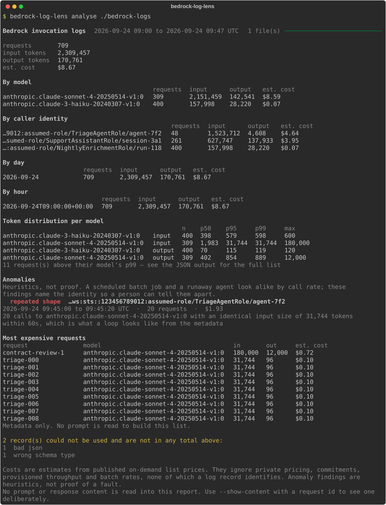

# bedrock-log-lens

Analyses Amazon Bedrock model invocation logs and reports token usage, cost and anomalies —
including agents stuck in loops — **without ever reading a prompt**.

[](https://github.com/imadelmakaoui-UJ/tools-aws/actions/workflows/bedrock-log-lens.yml)
[](https://www.python.org/downloads/)
[](LICENSE)

---

## The privacy problem, and what this does about it

Bedrock invocation logs contain **every prompt your users sent and every response the model
gave**, in full, in plain JSON. For most organisations that is the most sensitive data they
will ever put in an S3 bucket, and it sits there in a format that invites casual grepping.

Every operational question about those logs — how many calls, how many tokens, what it
cost, who is doing it, is something stuck in a loop — can be answered from the metadata
alone. So this tool answers them from the metadata alone.

**The guarantee is structural, not a policy anyone has to remember.**

1. `parse.py` drops `inputBodyJson` and `outputBodyJson` when it reads a record. It is the
   only module that ever holds one, and it holds it for the length of a function call.
2. The type everything downstream is built from has **no field capable of holding content**:

   ```python
   def test_the_record_type_has_nowhere_to_put_content() -> None:
       names = [field.name for field in dataclasses.fields(InvocationRecord)]
       assert content_bearing_fields(names) == ()
   ```

   A future edit that adds a `prompt_preview` field fails the build. That may be a
   deliberate choice, but it has to be argued for rather than slipped in.
3. No report, JSON payload or HTML file needs a redaction step, because none of them is
   ever given anything to redact.

Showing content is a **separate command** that re-reads the files for the request ids you
name. Keeping it out of the pipeline is exactly what makes the guarantee hold: if records
carried prompts and a flag decided whether to print them, every output path would be one
forgotten check away from a leak.

### How this is proved rather than asserted

Every fixture record carries a canary string inside its prompt and its response. The tests
run the real commands over those fixtures and assert the canary appears in none of the
terminal output, the JSON, the HTML file on disk, or the records themselves — and one test
asserts the canary is **still in the fixtures**, so a passing suite can never be a suite
testing nothing.

I verified those tests bite by breaking privacy on purpose, two ways: adding a
content-bearing field to the record type, and making the parser smuggle a prompt into a
metadata field. Both fail the build.

---

## Demo



Exported from a real run by [`scripts/make_demo.py`](scripts/make_demo.py) against invented
log records — which carry prompt bodies, so the image is itself evidence that none of it
reaches the report. CI regenerates it and fails if it no longer matches.

---

## Install

```bash
pipx install git+https://github.com/imadelmakaoui-UJ/tools-aws.git#subdirectory=bedrock-log-lens

# only if you want to read from S3:
pipx install "git+https://github.com/imadelmakaoui-UJ/tools-aws.git#subdirectory=bedrock-log-lens[s3]"
```

**Analysing a local directory makes no AWS calls and needs no credentials.** `boto3` is an
optional extra imported inside `s3.py`; a test starts a fresh interpreter to confirm that
importing the package does not pull it in.

---

## Usage

```bash
bedrock-log-lens analyse ./bedrock-logs               # a directory, or a single file
bedrock-log-lens analyse ./logs --output json | jq '.anomalies'
bedrock-log-lens analyse ./logs --html report.html    # one self-contained file
bedrock-log-lens analyse --s3 s3://my-logs/AWSLogs/123456789012/BedrockModelInvocationLogs/
```

Gzipped or plain, one JSON object per file, a JSON array, or one object per line — the
layout is detected from the bytes, not the file extension.

### Exit codes

| Code | Meaning |
|---|---|
| `0` | analysed, nothing matched a heuristic |
| `1` | analysed, at least one anomaly found |
| `2` | a usage error |
| `3` | a data file is missing, malformed, or missing a source or rationale |
| `4` | the logs could not be read at all |

Exit code `1` makes it usable as a scheduled check.

### Seeing a prompt, deliberately

```bash
bedrock-log-lens show-content ./logs --request-id abc-123 --show-content
```

Without the second flag it refuses. Either way it prints an unsuppressible warning first.
It re-reads the log files; nothing from the analysis run is kept.

---

## What it reports

- **Totals** — requests, input, output and cache tokens, estimated cost.
- **Grouped** by model, by caller identity, by hour and by day.
- **Per-model p50/p95/p99** for input and output tokens, with requests above p99 flagged.
  A model with too few requests is marked as a thin sample rather than presented as a
  distribution: with five requests, a p99 is the largest one wearing a statistical hat.
- **Anomalies**, labelled as heuristics wherever they appear.
- **Top N most expensive requests**, metadata only.
- **Records it could not use**, counted by reason. A run where much of the input failed to
  parse should look obviously wrong, not quietly produce a small total.

### The anomaly heuristics

| Heuristic | What it looks for |
|---|---|
| `burst` | many calls from one identity inside a short window |
| `rate_jump` | a window far above **that identity's own** median rate |
| `repeated_shape` | one identity, one model, an **identical input token count**, repeating |

The third is the one written for agents. A stuck agent re-sends the same context, so its
input token count stops changing — while a healthy conversation grows on every turn. That
is visible in the metadata, with no access to a single prompt. Both cases are tested.

None of these is proof. A nightly batch job and a runaway agent are indistinguishable by
call rate alone, which is why every finding names the identity, the window, the call count
and the cost, and leaves the judgement to a person.

---

## Costing, and what AWS does not publish

The AWS Price List **does** carry Bedrock token rates. It does **not** carry Bedrock model
IDs: every product has six attributes, and prices are keyed by marketing name
(`"Claude Sonnet 4 (Amazon Bedrock Edition)"`) while logs carry
`anthropic.claude-sonnet-4-20250514-v1:0`. There is no published mapping between them.

Rather than hand-type a table of model IDs — typing from memory the numbers that decide
what a report says something cost — [`match.py`](src/bedrock_log_lens/match.py) states a
rule and applies it. Both sides reduce to lowercase tokens, and a price applies **only when
the two lists are equal**:

```
anthropic.claude-sonnet-4-20250514-v1:0     → Claude Sonnet 4
global.anthropic.claude-opus-4-5-…-v1:0     → Claude Opus 4.5   (global rate)
anthropic.claude-3-5-sonnet-20241022-v2:0   → Claude 3.5 Sonnet v2
cohere.command-r-plus-v1:0                  → Cohere Command R+
meta.llama3-70b-instruct-v1:0               → unpriced
```

No fuzzy matching: a near-miss is reported as **unpriced**, which is visible, rather than
priced from the closest guess, which is not. Any total containing an unpriced request says
so and is presented as a floor.

`model_name_overrides` in `prices.yaml` exists for what the rule cannot reach, each entry
requiring its own source. It is currently empty, which is the healthy state.

Cache reads and writes are priced at their own rates rather than folded into the input
count — a cached read is roughly a tenth of a fresh input token, and folding them together
would misprice exactly the workloads that use caching most.

Override everything with `--prices your-rates.yaml` if you have negotiated pricing.

---

## AWS permissions

Only needed for `--s3`. Printed by `bedrock-log-lens policy`, generated from the allowlist
the code enforces plus a sourced mapping of API operation to IAM action — they are not the
same thing here, since listing objects is the `ListObjectsV2` API but the `s3:ListBucket`
permission, granted on the bucket rather than on the objects:

```json
{
  "Version": "2012-10-17",
  "Statement": [
    {
      "Sid": "BedrockLogLensListPrefix",
      "Effect": "Allow",
      "Action": ["s3:ListBucket"],
      "Resource": "arn:aws:s3:::YOUR-LOG-BUCKET",
      "Condition": {
        "StringLike": {"s3:prefix": ["AWSLogs/*/BedrockModelInvocationLogs/*/*"]}
      }
    },
    {
      "Sid": "BedrockLogLensReadObjects",
      "Effect": "Allow",
      "Action": ["s3:GetObject"],
      "Resource": "arn:aws:s3:::YOUR-LOG-BUCKET/AWSLogs/*/BedrockModelInvocationLogs/*/*"
    }
  ]
}
```

Both operations are reads, checked against an allowlist before the call is made. Tests
attempt `PutObject`, `DeleteObject`, `DeleteObjects`, `CreateBucket` and `PutBucketPolicy`
through the guard and assert each is refused before anything reaches S3.

---

## The record schema

Parsed against the documented `ModelInvocationLog` schema, version 1.x:

```
schemaType · schemaVersion · timestamp · accountId · region · requestId · operation · modelId
identity   { arn }
input      { inputContentType, inputTokenCount, cacheReadInputTokenCount,
             cacheWriteInputTokenCount, inputBodyJson  ← dropped }
output     { outputContentType, outputTokenCount, outputBodyJson  ← dropped }
```

The parser reaches inside a content field exactly once, to read the four integers in
`amazon-bedrock-invocationMetrics`, and copies nothing else out.

**Tolerance is a requirement, not a nicety.** A record this tool cannot use is counted and
described; it never raises. Skipped records are reported by reason — bad JSON, a different
`schemaType`, a 2.x schema version, a missing `modelId`, missing token counts — and a
record with no token counts is reported rather than counted as zero, which would quietly
shrink every total it belongs to.

An error record with no token counts is *kept*: a throttled call really happened and really
cost nothing.

---

## Where the numbers come from

Two files, and a rule the loader enforces on both:

* an **AWS fact** — the schema type, the supported version, the content field names, the S3
  prefix layout, the read-only operations and their IAM actions — must carry a `source` URL;
* a **judgement call** — every threshold, including all three anomaly heuristics — must
  carry a `rationale` saying why that number and not another.

Loading fails without them, so a number cannot arrive without saying which kind it is.
`tests/test_catalog.py` deletes a `source` and a `rationale` and asserts the file is
refused, and checks that no threshold cites a source, which would dress an opinion up as
documentation.

[`prices.yaml`](src/bedrock_log_lens/data/prices.yaml) is generated by
[`scripts/fetch_prices.py`](scripts/fetch_prices.py) from the AWS Price List bulk API —
1,482 rates across 35 regions, carrying AWS's own publication date. Batch, latency-optimized
and provisioned-throughput rates are deliberately excluded: a log record does not say which
applied, so including them would put a confident wrong number on those calls.

---

## Limitations

* **Costs are estimates** from published on-demand list prices. No private pricing, no
  commitments, no provisioned throughput, no batch rates — a log record identifies none of
  these.
* **Anomalies are heuristics.** They describe a shape in a call pattern, not a proven fault.
* **Identities are ARNs**, and they are shown in full. They are metadata, not content, and
  grouping by caller is the point — but an assumed-role session name can carry a username,
  so treat the output as you would any operational report.
* **Token counts come from the logs**, not from re-tokenising anything. If Bedrock did not
  record a count, this tool does not invent one.
* **It reads; it does not watch.** Point it at a window of logs and it reports on that
  window.
* **CloudWatch Logs delivery is not supported** — this reads the S3 destination.

---

## Development

```bash
uv venv && uv pip install -e . --group dev
.venv/bin/ruff check . && .venv/bin/ruff format --check .
.venv/bin/mypy
.venv/bin/pytest
.venv/bin/python scripts/make_demo.py       # regenerate docs/demo.svg
.venv/bin/python scripts/fetch_prices.py    # regenerate data/prices.yaml
```

161 tests, 89% coverage, `mypy --strict` clean, on Python 3.11 and 3.12.

**No test touches AWS**, and no test needs credentials. S3 reading is driven through a
botocore-shaped double; everything else runs against fixtures on disk.

---

## License

MIT — see [LICENSE](LICENSE).
