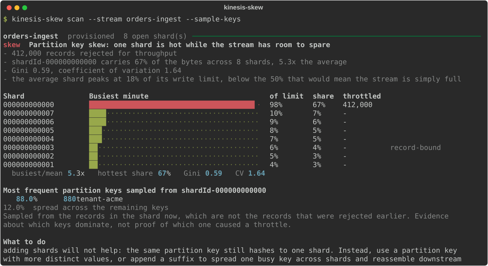

# kinesis-skew

Tells partition key skew apart from genuine under-provisioning in Kinesis Data Streams —
throttling caused by one hot shard while the others sit idle, rather than by a stream that
is simply too small.

[](https://github.com/imadelmakaoui-UJ/tools-aws/actions/workflows/kinesis-skew.yml)
[](https://www.python.org/downloads/)
[](LICENSE)

---

## The problem it solves

`WriteProvisionedThroughputExceeded` on a stream has two causes that look identical from
the stream-level metrics and have opposite fixes.

* **Partition key skew.** One key — a big tenant, a `null`, a hot device id — hashes to one
  shard and pins it at its 1 MB/s limit while the rest of the stream idles. **Adding shards
  does not help**, because the same key still hashes to one shard.
* **Not enough capacity.** Traffic is spread evenly and every shard is near its limit.
  Adding shards is exactly the fix.

The shard-level metrics separate them in seconds. This tool reads them, does the
arithmetic, and says which one you have.

---

## This tool is read-only

**It calls four AWS APIs to do its work, every one of them a read. It cannot create,
modify or delete anything — not a stream, not a shard, not a metric setting.**

| Service | Operation | Why |
|---|---|---|
| `kinesis` | `ListStreams` | find the streams in the region |
| `kinesis` | `DescribeStreamSummary` | capacity mode, open shard count, whether shard metrics are on |
| `kinesis` | `ListShards` | the shards open during the window, including those closed by a split |
| `cloudwatch` | `GetMetricData` | `IncomingBytes`, `IncomingRecords` and `WriteProvisionedThroughputExceeded` per shard |

Two more are used **only** when you pass `--sample-keys`:

| Service | Operation | Why |
|---|---|---|
| `kinesis` | `GetShardIterator` | start reading the busiest shard |
| `kinesis` | `GetRecords` | read a bounded sample to rank its partition keys |

Those two are not merely behind an `if`. **The flag builds the allowlist**: without
`--sample-keys` they are not in the permitted set, so the process cannot call them even if
the code tried. There is a test asserting both halves of that.

Everything goes through a wrapper that checks the operation before it reaches the network:

```python
# src/kinesis_skew/aws.py
if operation not in self._allowed:
    allowed = ", ".join(sorted(self._allowed))
    raise ReadOnlyViolationError(
        f"{self._service}:{operation} is not allowed. This tool is read-only and "
        f"may only call: {allowed}"
    )
```

`tests/test_aws.py` proves it by trying: it asks the guarded client to delete a stream, to
split a shard and — the one worth naming — to **enable enhanced monitoring**, which is the
very thing the tool tells you to do. It asserts each is refused and that nothing reached the
client. The IAM policy below is not typed out by hand either: `kinesis-skew policy` generates
it from the same allowlist the code enforces.

---

## Demo



Exported from a real run by [`scripts/make_demo.py`](scripts/make_demo.py) against
in-memory AWS responses, so it can be rebuilt without credentials. CI regenerates it and
fails if it no longer matches.

---

## Install

```bash
pipx install git+https://github.com/imadelmakaoui-UJ/tools-aws.git#subdirectory=kinesis-skew
```

Or from a clone:

```bash
cd kinesis-skew
uv venv && uv pip install -e . --group dev
```

---

## Usage

```bash
kinesis-skew scan                               # every stream in your configured region
kinesis-skew scan --stream orders-ingest        # one stream; repeatable
kinesis-skew scan --lookback-hours 6            # a tighter window
kinesis-skew scan --all                         # include healthy streams
kinesis-skew scan --output json | jq '.streams[0].diagnosis'
```

To see which keys are crowding the busiest shard:

```bash
kinesis-skew scan --stream orders-ingest --sample-keys
```

```
Most frequent partition keys sampled from shardId-000000000000
   88.0%      880  tenant-acme
   12.0%  spread across the remaining keys
```

The permissions and thresholds the tool is using:

```bash
kinesis-skew policy
kinesis-skew policy --output json | jq '.iam_policy'
```

### Exit codes

| Code | Meaning |
|---|---|
| `0` | scanned, nothing throttled |
| `1` | scanned, at least one stream has a problem |
| `2` | a usage error |
| `3` | the data file is missing, malformed, or missing a source or rationale |
| `4` | the scan could not complete (credentials, permissions, nothing readable) |

Exit code `1` on findings makes it usable as a scheduled check.

---

## How it works

**1. Check the stream can answer the question.** `DescribeStreamSummary` reports the
capacity mode and which shard-level metrics are enabled. If the ones this tool needs are
missing, it stops there and prints the command to enable them — it never runs it. It does
not ask CloudWatch for metrics that cannot exist, because an empty answer is
indistinguishable from an idle stream.

**2. List the shards that could have taken writes.** `ListShards` filtered from the start
of the window, not to the currently open shards: a shard closed by a split partway through
still holds the traffic it took before it closed.

**3. Read the metrics at one-minute resolution**, batched to stay inside both documented
`GetMetricData` caps. A 24-hour window is 1,440 datapoints per query, so 23 shards per call.

**4. Score each shard's busiest minute** against the two documented per-shard write limits,
1 MB/s and 1,000 records/s, and report which one binds.

**5. Diagnose**, as a pure function over those numbers:

| Verdict | What it means |
|---|---|
| `skew` | throttled, traffic concentrated, the stream has room to spare |
| `capacity` | throttled, traffic even, shards near their limit |
| `mixed` | both — one hot shard *and* the rest of the stream is busy |
| `bursty` | throttled, traffic even, no shard near its limit in any minute |
| `healthy` | nothing rejected |
| `no_shard_metrics` | enhanced monitoring is off; the question is unanswerable |
| `no_traffic` | nothing written in the window |

### Why the busiest minute, not the average

Throttling is decided per second; these metrics arrive per minute. A shard pinned for two
minutes an hour averages out to about 3% over a day, and that shard is the entire point.
Every utilisation figure here is a shard's busiest single minute.

That same gap is why `bursty` exists. Throttling with traffic spread evenly and no shard
near its limit in any minute means the spikes are *inside* a datapoint. Calling that
"under-provisioned" would name a cause the numbers do not show, and send you to add shards
when the fix is to stop the producer firing everything at once.

### On-demand streams

Handled as their own case throughout, and **never told to add shards** — they have no shard
count to set. An on-demand stream carries up to twice its peak write throughput of the last
30 days and throttles if traffic more than doubles inside 15 minutes, so its capacity
verdict describes that instead. Skew on an on-demand stream is still skew: auto-scaling
cannot save you from one key, because it still hashes to one shard.

### Resharding

A shard open for less than half the window is scored and shown but kept out of the
statistics. Without that, a split halfway through the window makes both children look quiet
beside shards that were open throughout — which reads as skew that is not there. The report
says how many shards were ranked and how many were not.

---

## AWS permissions

Printed by `kinesis-skew policy`, generated from the allowlist the code enforces:

```json
{
  "Version": "2012-10-17",
  "Statement": [
    {
      "Sid": "KinesisSkewReadOnly",
      "Effect": "Allow",
      "Action": [
        "cloudwatch:GetMetricData",
        "kinesis:DescribeStreamSummary",
        "kinesis:ListShards",
        "kinesis:ListStreams"
      ],
      "Resource": "*"
    }
  ]
}
```

`--sample-keys` needs a second statement, deliberately kept separate so nobody has to grant
record reads to run an ordinary scan:

```json
{
  "Sid": "KinesisSkewOptionalSampling",
  "Effect": "Allow",
  "Action": ["kinesis:GetRecords", "kinesis:GetShardIterator"],
  "Resource": "arn:aws:kinesis:*:*:stream/*"
}
```

`Resource: "*"` on the first statement is required: `ListStreams` and `GetMetricData` are
not resource-scoped. The two `Describe`/`List` shard actions can be narrowed to stream ARNs.

---

## About `--sample-keys`

It reads records. That is a real cost and the tool is blunt about it:

* it **consumes the shard's read throughput**, which is shared with your real consumers —
  a shard gives 2 MB/s and five `GetRecords` calls per second in total;
* it is **bounded**: at most 10 calls and 5,000 records, paced under the documented five
  calls per second, so it is over in about two seconds;
* it prints a warning to stderr before it runs;
* it samples **the records in the shard now**, which are not the records that were rejected
  earlier in the window. It is evidence about which keys dominate, not proof of which key
  caused a particular throttle. The output says so every time.

---

## Where the numbers come from

One file, [`data/limits.yaml`](src/kinesis_skew/data/limits.yaml), split by a rule the
loader enforces:

* an **AWS fact** — the 1 MB/s and 1,000 records/s shard limits, the metric names and
  namespace, the 60-second emission period, the `GetMetricData` caps, on-demand's 2× and
  15-minute scaling behaviour — must carry a `source` URL, or loading fails;
* a **judgement call** — the 3× busiest-to-mean ratio, the 0.4 Gini threshold, the 24-hour
  default window, the sampling budget — must carry a `rationale` saying why that number and
  not another, or loading fails.

There are no bare numbers in the code for either. `tests/test_catalog.py` deletes a `source`
and a `rationale` and asserts the file is refused, and checks no threshold cites a source,
which would dress up an opinion as documentation.

Verified 2026-09-24 against the Kinesis Data Streams developer guide and the Kinesis and
CloudWatch API models shipped in botocore.

---

## Limitations

* **Shard-level metrics are not free.** They are billed as CloudWatch custom metrics, per
  shard per metric. The tool tells you to enable them; it does not pretend they cost nothing.
* **One-minute resolution is the floor.** Sub-minute bursts are reported as `bursty` rather
  than pinpointed, because CloudWatch cannot show them.
* **CloudWatch keeps one-minute data for 15 days.** A longer lookback is refused rather
  than silently returning an empty window that would look like an idle stream.
* **Skew is measured on bytes**, not records. A stream throttled on the record limit by a
  key sending many tiny records is still detected — the per-shard utilisation reports which
  limit binds — but the concentration statistics rank shards by bytes.
* **It measures, it does not watch.** A key that was hot for an hour yesterday is diluted by
  a 24-hour window; narrow it with `--lookback-hours` if you know when the trouble was.
* **Enhanced fan-out consumers** are irrelevant here: this tool looks at the write side.

---

## Development

```bash
uv venv && uv pip install -e . --group dev
.venv/bin/ruff check . && .venv/bin/ruff format --check .
.venv/bin/mypy
.venv/bin/pytest
.venv/bin/python scripts/make_demo.py      # regenerate docs/demo.svg
```

129 tests, 91% coverage, `mypy --strict` clean, on Python 3.11 and 3.12.

**No test touches AWS.** The suite drives the tool through botocore-shaped fakes, and the
cases it covers are the ones that are easy to get wrong: enhanced monitoring off, a split
mid-window, a shard CloudWatch returns nothing for, a stream rejecting every write,
throttling retried with backoff, and `ListShards` refusing a `StreamName` alongside its own
`NextToken`.

---

## License

MIT — see [LICENSE](LICENSE).
