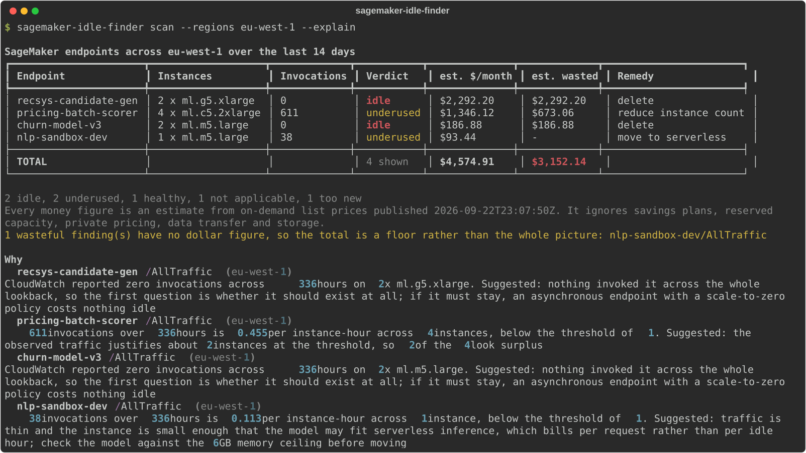

# sagemaker-idle-finder

Scans an AWS account for SageMaker endpoints that cost money while receiving little or no
traffic, estimates the waste, and names a specific remedy for each one.

[](https://github.com/imadelmakaoui-UJ/tools-aws/actions/workflows/sagemaker-idle-finder.yml)
[](https://www.python.org/downloads/)
[](LICENSE)

---

## This tool is read-only

**It calls five AWS APIs, every one of them a read. It cannot create, modify or delete
anything — not an endpoint, not a config, not a scaling policy.** It never deletes the
endpoints it reports; it tells you which ones to look at and what it would cost you to keep
them.

| Service | Operation | Why |
|---|---|---|
| `sagemaker` | `ListEndpoints` | find every endpoint in the region |
| `sagemaker` | `DescribeEndpoint` | status, creation time, current variants and instance counts |
| `sagemaker` | `DescribeEndpointConfig` | instance types, serverless config, inference components |
| `cloudwatch` | `GetMetricData` | the `Invocations` metric over the lookback window |
| `application-autoscaling` | `DescribeScalableTargets` | whether a variant can already scale to zero |

That list is not a promise in a document — it is the allowlist the code enforces. Every AWS
call goes through a wrapper that checks the operation against it and raises
`ReadOnlyViolationError` **before** anything reaches the network:

```python
# src/sagemaker_idle_finder/aws.py
if operation not in self._allowed:
    allowed = ", ".join(sorted(self._allowed))
    raise ReadOnlyViolationError(
        f"{self._service}:{operation} is not allowed. This tool is read-only and "
        f"may only call: {allowed}"
    )
```

Both files prove it rather than assert it. `tests/test_aws.py` asks the guarded client to
delete an endpoint, asserts the call is refused and that nothing reached the client, and
checks that no page of a paginated call escapes the guard. `tests/test_read_only.py` asserts
the allowlist contains nothing but read operations, that only `aws.py` imports an AWS SDK at
all, and that importing the package does not pull `boto3` in. The IAM policy
in this README is not typed out by hand either — `sagemaker-idle-finder policy` generates it
from that same allowlist, so the two cannot drift apart. CI additionally greps the whole of
`src/` for anything shaped like a write call.

---

## Demo



The image at [`docs/demo.svg`](docs/demo.svg) is exported from a real run by
[`scripts/make_demo.py`](scripts/make_demo.py), against in-memory AWS responses so it can be
rebuilt without credentials. CI regenerates it and fails if it no longer matches.

---

## Install

```bash
pipx install git+https://github.com/imadelmakaoui-UJ/tools-aws.git#subdirectory=sagemaker-idle-finder
```

Or from a clone:

```bash
cd sagemaker-idle-finder
uv venv && uv pip install -e . --group dev
```

Credentials come from the usual places — environment variables, a profile, an instance or
container role. `--profile` picks a named profile.

---

## Usage

Scan your configured region over the default fourteen-day lookback:

```bash
sagemaker-idle-finder scan
```

```
SageMaker endpoints across eu-west-1 over the last 14 days
┏━━━━━━━━━━━━━━━━━━━━━━┳━━━━━━━━━━━━━━━━━━━┳━━━━━━━━━━━━━┳━━━━━━━━━━━┳━━━━━━━━━━━━━━┳━━━━━━━━━━━━━┳━━━━━━━━━━━━━━━━━━━━━━━┓
┃ Endpoint             ┃         Instances ┃ Invocations ┃ Verdict   ┃ est. $/month ┃ est. wasted ┃ Remedy                ┃
┡━━━━━━━━━━━━━━━━━━━━━━╇━━━━━━━━━━━━━━━━━━━╇━━━━━━━━━━━━━╇━━━━━━━━━━━╇━━━━━━━━━━━━━━╇━━━━━━━━━━━━━╇━━━━━━━━━━━━━━━━━━━━━━━┩
│ recsys-candidate-gen │  2 x ml.g5.xlarge │           0 │ idle      │    $2,292.20 │   $2,292.20 │ delete                │
│ pricing-batch-scorer │ 4 x ml.c5.2xlarge │         611 │ underused │    $1,346.12 │     $673.06 │ reduce instance count │
│ churn-model-v3       │   2 x ml.m5.large │           0 │ idle      │      $186.88 │     $186.88 │ delete                │
│ nlp-sandbox-dev      │   1 x ml.m5.large │          38 │ underused │       $93.44 │           - │ move to serverless    │
├──────────────────────┼───────────────────┼─────────────┼───────────┼──────────────┼─────────────┼───────────────────────┤
│ TOTAL                │                   │             │ 4 shown   │    $4,574.91 │   $3,152.14 │                       │
└──────────────────────┴───────────────────┴─────────────┴───────────┴──────────────┴─────────────┴───────────────────────┘
```

More regions, a longer window, and the evidence behind each verdict:

```bash
sagemaker-idle-finder scan --regions eu-west-1,us-east-1 --lookback-days 30 --explain
sagemaker-idle-finder scan --regions all          # every region in the price file
sagemaker-idle-finder scan --all                  # show healthy and not-applicable rows too
sagemaker-idle-finder scan --threshold 5          # stricter idea of "used enough"
```

Machine-readable output, from the same objects that produce the table:

```bash
sagemaker-idle-finder scan --output json | jq '.estimates'
sagemaker-idle-finder scan --output csv > endpoints.csv
```

```json
{
  "note": "All money figures are estimates from published on-demand list prices. They ignore savings plans, reserved capacity, private pricing, data transfer and storage.",
  "prices_published": "2026-09-22T23:07:50Z",
  "total_estimated_monthly_usd": 4574.91,
  "total_estimated_wasted_monthly_usd": 3152.14,
  "findings_without_a_waste_estimate": 1,
  "totals_are_complete": false
}
```

The exact permissions the tool needs, and the thresholds it is using:

```bash
sagemaker-idle-finder policy
sagemaker-idle-finder policy --output json | jq '.iam_policy'
```

### Exit codes

| Code | Meaning |
|---|---|
| `0` | the scan completed and found nothing wasteful |
| `1` | the scan completed and found idle or underused endpoints |
| `2` | a usage error |
| `3` | a data file is missing, malformed, or missing a source or rationale |
| `4` | the scan could not complete (credentials, permissions, every region failed) |

Exit code `1` on findings makes it usable as a scheduled check.

---

## How it works

**1. Collect.** `ListEndpoints` is paginated across each region, then each endpoint is
described along with its config. Runtime instance counts come from `DescribeEndpoint`, the
instance type and serverless settings from `DescribeEndpointConfig`. Registered scaling
targets are read from Application Auto Scaling for both the variant dimension
(`sagemaker:variant:DesiredInstanceCount`) and the inference-component dimension
(`sagemaker:inference-component:DesiredCopyCount`).

**2. Measure.** `Invocations` is summed hourly over the lookback for every variant, batched
into `GetMetricData` calls sized to stay inside both documented quotas — at most 500 queries
per call and 100,800 datapoints per call. At the default fourteen days that is 336
datapoints per query, so batches of 300; a one-day window batches 500 and a ninety-day
window 46. Throttling is retried with exponential backoff.

A metric that CloudWatch answers with *no data* is kept distinct from one it answers with a
measured zero. They are not the same claim, and collapsing them would invent idleness.

**3. Classify.** In order, so that the first thing that applies wins:

| Verdict | When |
|---|---|
| `not_billing` | the endpoint is `Creating`, `Failed`, `Deleting` … — it is not charging for instances |
| `not_applicable` | serverless: it already costs nothing between requests |
| `not_applicable` | a scaling target with **minimum capacity 0** — it can already scale to zero, so it is not idle waste |
| `too_new` | it existed for less than 80% of the window; there is not enough history to judge |
| `idle` | zero invocations across the whole window |
| `underused` | below **1.0 invocation per instance-hour** |
| `healthy` | at or above the threshold |

**4. Cost.** Instance-hours are priced from the bundled `prices.yaml` at 730 hours a month.
An `idle` variant wastes its whole cost. An `underused` variant wastes only the instances
its traffic does not justify. Where there is no surplus to remove — one instance, thin
traffic — the waste is reported as **unknown rather than zero**, because zero would read as
"nothing to reclaim here" when the truth is that reclaiming it means changing how the model
is served, not removing a box. A price the file does not contain produces `-` and a stated
reason, never a silent `0.00`, and the total then says it is a floor.

**5. Recommend.** `delete` for something nothing has called; `move to serverless` for thin
traffic on a small, non-accelerated instance; `move to async with scale-to-zero` where the
instance is large or has a GPU, since serverless has neither; `reduce instance count` where
the traffic is real but does not justify the fleet.

Steps 3, 4 and 5 are pure functions over plain data — no clients, no network — and are
tested directly.

### Costing a move to serverless

Serverless is billed per request, so pricing it needs two things no read-only API will tell
you: how long a request takes, and how much memory the model needs. The tool will not guess
at either. Supply them and it does the arithmetic:

```bash
sagemaker-idle-finder scan --serverless-seconds 0.4 --serverless-memory-gb 3
```

Findings whose remedy is a serverless move then carry an
`estimated_serverless_monthly_usd`, the evidence says the figure rests on what you supplied,
and the waste that could not be quantified above becomes the difference between the two. The
two options go together: half of them would mean the tool filling in the other half.

---

## AWS permissions

The policy below is printed by `sagemaker-idle-finder policy`, generated from the allowlist
the code enforces at runtime:

```json
{
  "Version": "2012-10-17",
  "Statement": [
    {
      "Sid": "SageMakerIdleFinderReadOnly",
      "Effect": "Allow",
      "Action": [
        "application-autoscaling:DescribeScalableTargets",
        "cloudwatch:GetMetricData",
        "sagemaker:DescribeEndpoint",
        "sagemaker:DescribeEndpointConfig",
        "sagemaker:ListEndpoints"
      ],
      "Resource": "*"
    }
  ]
}
```

`Resource: "*"` is required: `ListEndpoints` and `GetMetricData` are not resource-scoped.
If you want to narrow it, scope the two `Describe` actions to endpoint ARNs — but the tool
discovers endpoints before it knows their names, so `ListEndpoints` has to stay open.

`SecurityAudit`, `ReadOnlyAccess` or `ViewOnlyAccess` all cover this too.

---

## Where the numbers come from

Two data files, one purpose each, both read only through `catalog.py`.

**[`data/prices.yaml`](src/sagemaker_idle_finder/data/prices.yaml)** — on-demand hosting
prices for 37 regions, generated by [`scripts/fetch_prices.py`](scripts/fetch_prices.py)
from the AWS Price List bulk API, carrying AWS's own publication date. Override it with
`--prices` to use negotiated rates. Regenerate with:

```bash
.venv/bin/python scripts/fetch_prices.py
```

**[`data/policy.yaml`](src/sagemaker_idle_finder/data/policy.yaml)** — everything else, split
in two by a rule the loader enforces:

* an **AWS fact** (the metric namespace, the scalable dimensions, the `GetMetricData`
  quotas, the 6 GB serverless memory ceiling) must carry a `source` URL, or loading fails;
* a **judgement call** (the 1.0 invocations-per-instance-hour threshold, the 14-day default,
  the 80% coverage floor) must carry a `rationale` saying why that number and not another,
  or loading fails.

There are no bare numbers in the code for either. `tests/test_catalog.py` deletes a `source`
and a `rationale` and asserts the loader refuses the file.

---

## Limitations

* **Every money figure is an estimate.** On-demand list prices only: no savings plans, no
  reserved capacity, no private pricing, no data transfer, no storage. Treat the ranking as
  reliable and the absolute numbers as indicative.
* **`Invocations` is not the only reason an endpoint exists.** A disaster-recovery standby,
  a warm endpoint held for a launch, or one called only at quarter-end will look idle on a
  fourteen-day window. The tool says what it measured; you know what it is for.
* **Inference components are not enumerated.** A variant that serves them is detected and
  costed, and its evidence says so, but this tool does not call `ListInferenceComponents`,
  so per-component traffic is not broken out.
* **Serverless endpoints get no standing cost.** They are billed per request, so there is no
  idle cost to reclaim and they are reported as not applicable.
* **A region missing from the price file** produces findings without money figures rather
  than guesses, and the total says it is incomplete.
* **Multi-model endpoints** are judged on the variant's total invocations, not per model.

---

## Development

```bash
uv venv && uv pip install -e . --group dev
.venv/bin/ruff check . && .venv/bin/ruff format --check .
.venv/bin/mypy
.venv/bin/pytest
.venv/bin/python scripts/make_demo.py      # regenerate docs/demo.svg
.venv/bin/python scripts/fetch_prices.py   # regenerate data/prices.yaml
```

190 tests, 95% coverage, `mypy --strict` clean, on Python 3.11 and 3.12.

**No test touches AWS.** The suite drives the tool through botocore-shaped fakes and
in-memory responses; `tests/test_read_only.py` guards the allowlist, and the scan tests
cover the cases that are easy to get wrong: an endpoint created inside the lookback window,
`Creating` and `Failed` statuses, inference-component variants, throttling with backoff, and
a metric with no data at all.

---

## License

MIT — see [LICENSE](LICENSE).
