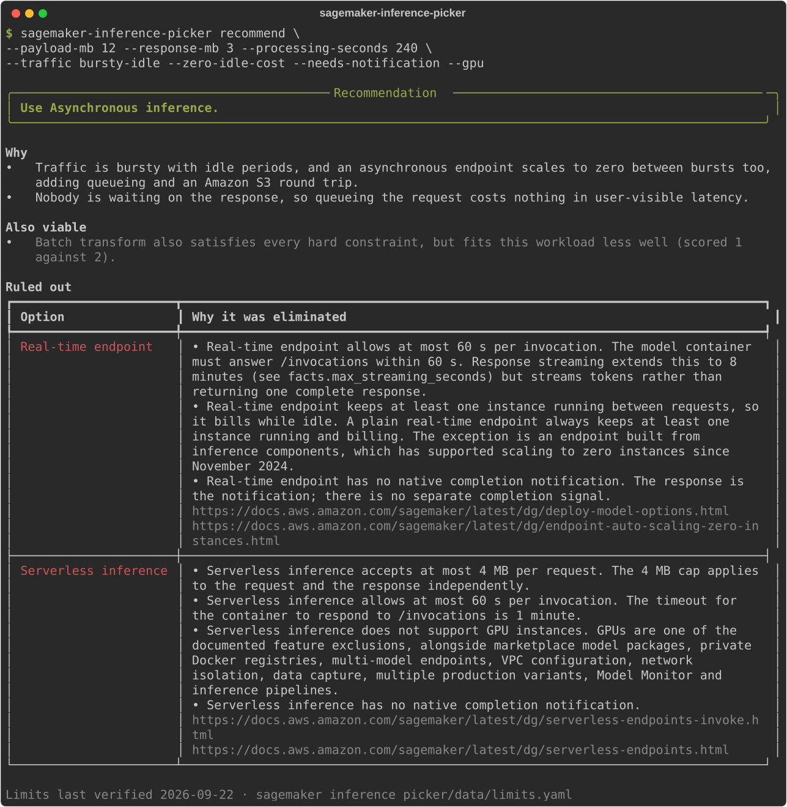

# sagemaker-inference-picker

Recommends the right Amazon SageMaker inference option for a workload and explains, with a
citation, why every other option was ruled out.

[](https://github.com/imadelmakaoui-UJ/tools-aws/actions/workflows/ci.yml)
[](https://www.python.org/downloads/)
[](LICENSE)

---

## This tool never touches AWS

**It calls no AWS API, opens no network connection and needs no credentials.**

| | |
|---|---|
| AWS APIs called | **none** |
| AWS credentials required | **none** |
| IAM permissions required | **none** |
| Network access required | **none** |

It is a decision tool, not a client. It compares the workload you describe against AWS's
published limits, which are stored in a data file inside the package. Nothing is read from
or written to your account, so it is safe to run against production assumptions from a
laptop with no profile configured.

That is not just a promise in a README. `tests/test_no_aws_calls.py` parses every source
file and fails the build if any of them imports `boto3`, `botocore`, `requests`, `httpx`,
`urllib`, `socket` or any other network client, and separately asserts that no AWS SDK
appears in the dependency list. The full runtime dependency list is three packages: Typer,
Rich and PyYAML.

See [AWS permissions](#aws-permissions) for the IAM policy, which is empty.

---

## Demo

A workload with a 12 MB payload, four minutes of GPU processing, bursty traffic, a
zero-idle-cost requirement and a need for completion notifications:



<details>
<summary>Same output as text</summary>

```console
$ sagemaker-inference-picker recommend \
    --payload-mb 12 --response-mb 3 --processing-seconds 240 \
    --traffic bursty-idle --zero-idle-cost --needs-notification --gpu

╭─────────────────────────────────────────── Recommendation ───────────────────────────────────────────╮
│ Use Asynchronous inference.                                                                          │
╰──────────────────────────────────────────────────────────────────────────────────────────────────────╯

Why
  • Traffic is bursty with idle periods, and an asynchronous endpoint scales to zero between bursts too,
    adding queueing and an Amazon S3 round trip.
  • Nobody is waiting on the response, so queueing the request costs nothing in user-visible latency.

Also viable
  • Batch transform also satisfies every hard constraint, but fits this workload less well (scored 1
    against 2).

Ruled out
┏━━━━━━━━━━━━━━━━━━━━━━┳━━━━━━━━━━━━━━━━━━━━━━━━━━━━━━━━━━━━━━━━━━━━━━━━━━━━━━━━━━━━━━━━━━━━━━━━━━━━━━━┓
┃ Option               ┃ Why it was eliminated                                                         ┃
┡━━━━━━━━━━━━━━━━━━━━━━╇━━━━━━━━━━━━━━━━━━━━━━━━━━━━━━━━━━━━━━━━━━━━━━━━━━━━━━━━━━━━━━━━━━━━━━━━━━━━━━━┩
│ Real-time endpoint   │ • Real-time endpoint allows at most 60 s per invocation. The model container  │
│                      │ must answer /invocations within 60 s. Response streaming extends this to 8    │
│                      │ minutes (see facts.max_streaming_seconds) but streams tokens rather than      │
│                      │ returning one complete response.                                              │
│                      │ • Real-time endpoint keeps at least one instance running between requests, so │
│                      │ it bills while idle. A plain real-time endpoint always keeps at least one     │
│                      │ instance running and billing. The exception is an endpoint built from         │
│                      │ inference components, which has supported scaling to zero instances since     │
│                      │ November 2024.                                                                │
│                      │ • Real-time endpoint has no native completion notification. The response is   │
│                      │ the notification; there is no separate completion signal.                     │
│                      │ https://docs.aws.amazon.com/sagemaker/latest/dg/deploy-model-options.html     │
│                      │ https://docs.aws.amazon.com/sagemaker/latest/dg/endpoint-auto-scaling-zero-in │
│                      │ stances.html                                                                  │
├──────────────────────┼───────────────────────────────────────────────────────────────────────────────┤
│ Serverless inference │ • Serverless inference accepts at most 4 MB per request. The 4 MB cap applies │
│                      │ to the request and the response independently.                                │
│                      │ • Serverless inference allows at most 60 s per invocation. The timeout for    │
│                      │ the container to respond to /invocations is 1 minute.                         │
│                      │ • Serverless inference does not support GPU instances. GPUs are one of the    │
│                      │ documented feature exclusions, alongside marketplace model packages, private  │
│                      │ Docker registries, multi-model endpoints, VPC configuration, network          │
│                      │ isolation, data capture, multiple production variants, Model Monitor and      │
│                      │ inference pipelines.                                                          │
│                      │ • Serverless inference has no native completion notification.                 │
│                      │ https://docs.aws.amazon.com/sagemaker/latest/dg/serverless-endpoints-invoke.h │
│                      │ tml                                                                           │
│                      │ https://docs.aws.amazon.com/sagemaker/latest/dg/serverless-endpoints.html     │
└──────────────────────┴───────────────────────────────────────────────────────────────────────────────┘

Limits last verified 2026-09-22 · sagemaker_inference_picker/data/limits.yaml
```

</details>

The demo image is exported from a real run by [`scripts/make_demo.py`](scripts/make_demo.py),
not mocked up, so it cannot drift away from what the tool actually prints.

### There is also a web version

The same picker runs as a single static page for GitHub Pages:
[`docs/sagemaker-inference-picker/index.html`](../docs/sagemaker-inference-picker/index.html).
It is generated from `limits.yaml` by
[`scripts/build_page.py`](scripts/build_page.py), so the website and the CLI read the same
numbers, and it inlines everything — it makes no network requests at all, and works opened
straight from disk.

The page necessarily re-implements the rules in JavaScript, which is a drift risk. So
`tests/test_web_parity.py` runs the CLI's own scenario corpus through both engines and
fails the build if they disagree on any decision, and `tests/test_web_page.py` fails the
build if the committed page has gone stale against `limits.yaml`.

To publish it: repository **Settings → Pages → Deploy from a branch**, branch `main`,
folder `/docs`. The repository root `docs/` directory is the Pages site for every tool
here, so this page is published at `/sagemaker-inference-picker/`.

---

## Install

```bash
pipx install .
```

Or straight from the repository:

```bash
pipx install "git+https://github.com/imadelmakaoui-UJ/tools-aws.git"
```

Or for development, with [uv](https://docs.astral.sh/uv/):

```bash
uv venv
uv pip install -e . --group dev
```

Python 3.11 or newer.

---

## Usage

### Recommend an option from flags

Four flags are always required — payload size, response size, processing time and traffic
pattern. They have no sensible defaults, and guessing at them would quietly change the
answer, so the tool refuses rather than assuming.

```bash
sagemaker-inference-picker recommend \
    --payload-mb 0.05 \
    --response-mb 0.01 \
    --processing-seconds 0.2 \
    --traffic steady \
    --latency-p99-ms 100 \
    --immediate-response
```

| Flag | Meaning |
|---|---|
| `--payload-mb` | Request payload size in MB. **Required.** |
| `--response-mb` | Response size in MB. **Required.** |
| `--processing-seconds` | Model processing time per request. **Required.** |
| `--traffic` | `steady`, `bursty-idle` or `scheduled-batch`. **Required.** |
| `--latency-p99-ms` | p99 latency target. Omit if there is none. |
| `--gpu` | A GPU is required. |
| `--zero-idle-cost` | Must cost nothing while idle. |
| `--immediate-response` | The caller needs the prediction in the same request. |
| `--needs-notification` | A completion notification is required. |
| `--models` | Number of models to host. Default 1. |
| `--interactive`, `-i` | Ask for the inputs instead of reading flags. |
| `--output`, `-o` | `text` (default) or `json`. |
| `--limits-file` | Use your own copy of the limits data. |

### Answer questions instead

```bash
sagemaker-inference-picker recommend --interactive
```

Invalid answers are re-asked, never guessed at or silently coerced.

### Get JSON

Every command supports `--output json`. In JSON mode stdout carries nothing but the
document — the human-readable console output moves to stderr — so it pipes cleanly, even in
interactive mode.

```bash
sagemaker-inference-picker recommend \
    --payload-mb 800 --response-mb 50 --processing-seconds 1800 \
    --traffic bursty-idle --needs-notification --output json | jq .recommended
```

```json
"async"
```

Each rejection in the JSON carries the constraint that caused it, the documented limit, the
actual value and the AWS page it came from:

```bash
… --output json | jq '.rejected[] | select(.option == "real_time") | .reasons[0]'
```

```json
{
  "constraint_id": "request_payload_over_limit",
  "requirement": "request payload of 800 MB",
  "message": "Real-time endpoint accepts at most 25 MB per request. Raised from the widely-cited legacy 6 MB limit; exceeding it surfaces as an HTTP 413 ModelError from InvokeEndpoint.",
  "limit": "25 MB",
  "actual": "800 MB",
  "source": "https://docs.aws.amazon.com/sagemaker/latest/dg/hosting-faqs.html"
}
```

### Inspect the limits the decision rests on

```bash
sagemaker-inference-picker limits
```

```console
AWS-documented limits · last verified 2026-09-22
┏━━━━━━━━━━━━━━━━━━━━━━━━┳━━━━━━━━━━━━┳━━━━━━━━━━━━┳━━━━━━━━━━━━━┳━━━━━┳━━━━━━━━━┳━━━━━━━━┳━━━━━━━━┓
┃                        ┃        Max ┃        Max ┃             ┃     ┃         ┃        ┃        ┃
┃ Option                 ┃    payload ┃   response ┃    Max time ┃ GPU ┃ To zero ┃ Inline ┃ Notify ┃
┡━━━━━━━━━━━━━━━━━━━━━━━━╇━━━━━━━━━━━━╇━━━━━━━━━━━━╇━━━━━━━━━━━━━╇━━━━━╇━━━━━━━━━╇━━━━━━━━╇━━━━━━━━┩
│ Real-time endpoint     │      25 MB │      25 MB │        60 s │ yes │   no    │  yes   │   no   │
├────────────────────────┼────────────┼────────────┼─────────────┼─────┼─────────┼────────┼────────┤
│ Serverless inference   │       4 MB │       4 MB │        60 s │ no  │   yes   │  yes   │   no   │
├────────────────────────┼────────────┼────────────┼─────────────┼─────┼─────────┼────────┼────────┤
│ Asynchronous inference │ 1024 MB (1 │       none │   3600 s (1 │ yes │   yes   │   no   │  yes   │
│                        │        GB) │            │       hour) │     │         │        │        │
├────────────────────────┼────────────┼────────────┼─────────────┼─────┼─────────┼────────┼────────┤
│ Batch transform        │     100 MB │       none │   3600 s (1 │ yes │   yes   │   no   │  yes   │
│                        │            │            │       hour) │     │         │        │        │
└────────────────────────┴────────────┴────────────┴─────────────┴─────┴─────────┴────────┴────────┘
"none" means AWS documents no limit for that dimension. "To zero" means the option can scale to zero
instances and stop billing while idle.

Sources
  Real-time endpoint
    https://docs.aws.amazon.com/sagemaker/latest/dg/hosting-faqs.html
    https://docs.aws.amazon.com/sagemaker/latest/dg/deploy-model-options.html
    https://docs.aws.amazon.com/sagemaker/latest/dg/endpoint-auto-scaling-zero-instances.html
    https://docs.aws.amazon.com/sagemaker/latest/dg/multi-model-endpoints.html
  Serverless inference
    https://docs.aws.amazon.com/sagemaker/latest/dg/serverless-endpoints-invoke.html
    https://docs.aws.amazon.com/sagemaker/latest/dg/serverless-endpoints.html
  Asynchronous inference
    https://docs.aws.amazon.com/sagemaker/latest/dg/async-inference.html
    https://docs.aws.amazon.com/sagemaker/latest/APIReference/API_runtime_InvokeEndpointAsync.html
    https://docs.aws.amazon.com/sagemaker/latest/dg/multi-model-endpoints.html
  Batch transform
    https://docs.aws.amazon.com/sagemaker/latest/APIReference/API_CreateTransformJob.html
    https://docs.aws.amazon.com/sagemaker/latest/dg/batch-transform.html
    https://docs.aws.amazon.com/sagemaker/latest/dg/multi-model-endpoints.html

AWS changes quotas without notice and several of these limits are soft (raisable via a service quota
increase). Re-verify before relying on a recommendation for a production design.
Loaded from sagemaker_inference_picker/data/limits.yaml
```

### Exit codes

| Code | Meaning |
|---|---|
| `0` | A recommendation was produced. |
| `1` | No option satisfies the requirements. The conflicts are reported. |
| `2` | Usage error — a missing or invalid flag. |
| `3` | The limits file is missing, malformed, or has a value without a source. |

Exit code 1 makes impossible requirements detectable from a script:

```bash
if ! sagemaker-inference-picker recommend … --output json > result.json; then
    echo "these requirements cannot all be met"
fi
```

---

## How it works

Four options are considered: **real-time endpoint**, **serverless inference**,
**asynchronous inference** and **batch transform**.

### 1. Hard constraints eliminate

A hard constraint is a documented AWS limit or a missing capability. Breaching one removes
an option from consideration entirely — no amount of preference can bring it back.

| Constraint | Eliminates an option when |
|---|---|
| `request_payload_over_limit` | The payload exceeds the option's documented maximum. |
| `response_payload_over_limit` | The response exceeds the option's documented maximum. |
| `processing_time_over_limit` | Processing time exceeds the option's documented maximum. |
| `gpu_not_supported` | A GPU is required and the option has no GPU support. |
| `cannot_scale_to_zero` | Idle cost must be zero and the option bills while idle. |
| `no_inline_response` | The caller waits for the result and the option never answers the caller. |
| `no_native_completion_notification` | A completion notification is required and the option has none. |

Limits are inclusive: a payload of exactly 4 MB passes on serverless, 4.000001 MB does not.
Setting `--latency-p99-ms` implies `--immediate-response`, because an option that never
returns a result to the caller cannot meet a latency target at all.

### 2. Soft preferences rank the survivors

Whatever survives is scored by weighted preferences — traffic pattern fit, latency
tolerance, whether anyone is waiting on the answer, and how many models are involved. Every
weight is declared in `limits.yaml` with a written rationale; none is hard-coded. A tie is
broken in favour of the option with the least always-on infrastructure to operate and pay
for.

### 3. Secondary advice

Where relevant the tool also suggests a deployment pattern layered on top of the
recommendation: a **multi-model endpoint** for many mostly-idle models, **inference
components** for models needing separate resources and scaling, and **provisioned
concurrency** where serverless wins but cold starts would breach the latency target.

One case is worth calling out. A real-time endpoint is eliminated by a zero-idle-cost
requirement, but an inference-component endpoint has been able to scale to zero since
November 2024. When that is the *only* thing blocking real-time and you have been pushed to
an offline option as a result, the tool says so rather than letting you take the long way
round.

### 4. If nothing fits, it says so

The tool never falls back to a best guess. When every option is eliminated it names the
requirements that cannot hold together and which option each one killed:

```console
╭──────────────────────────────────────── No viable option ────────────────────────────────────────╮
│ No SageMaker inference option satisfies all of these requirements.                               │
╰──────────────────────────────────────────────────────────────────────────────────────────────────╯

Conflicting requirements
  • The caller needs an immediate response — rules out Asynchronous inference and Batch transform.
  • Must cost nothing when idle — rules out Real-time endpoint.
  • A GPU is required — rules out Serverless inference.
  • No single SageMaker option covers all of these at once. Drop or relax one of them, or split the
    workload so that different requirements are served by different options.

Ruled out
  (the full table of rejections and their sources is shown in the demo above)

Also consider
  Inference components (scale to zero)
    A real-time endpoint was ruled out only because it bills while idle. That is the one constraint
    inference components can lift: an inference-component endpoint can scale to zero instances, so
    it is worth evaluating if the rest of real-time suits you. Give each model its own CPU, GPU,
    memory and copy count on a shared endpoint, and let each scale independently.
    Inference-component endpoints can also scale to zero instances, which a plain real-time endpoint
    cannot.
    https://docs.aws.amazon.com/sagemaker/latest/dg/endpoint-auto-scaling-zero-instances.html

Limits last verified 2026-09-22 · sagemaker_inference_picker/data/limits.yaml
```

---

## Where the numbers come from

Every AWS limit lives in one file,
[`src/sagemaker_inference_picker/data/limits.yaml`](src/sagemaker_inference_picker/data/limits.yaml).
There are no magic numbers in the decision code — not even the preference weights or
thresholds.

Each entry carries the value, the AWS documentation page it was verified against, and often
a note capturing a caveat from that page:

```yaml
max_request_payload_mb:
  value: 4
  source: "https://docs.aws.amazon.com/sagemaker/latest/dg/serverless-endpoints-invoke.html"
  note: "The 4 MB cap applies to the request and the response independently."
```

The loader enforces this rather than trusting the author: a value that arrives without a
`source` URL is a load error, and a heuristic that arrives without a `rationale` is a load
error. `tests/test_limits.py` asserts both against the real file.

Run `sagemaker-inference-picker limits --output json` to get the whole dataset, sources and
rationales included. Point `--limits-file` at your own copy to override anything.

### Currently verified values

Last verified **2026-09-22** against the SageMaker AI Developer Guide and API Reference.

| | Real-time | Serverless | Asynchronous | Batch transform |
|---|---|---|---|---|
| Max payload | 25 MB | 4 MB | 1 GB | 100 MB per record |
| Max processing | 60 s | 60 s | 3600 s | 3600 s per invocation |
| GPU | yes | **no** | yes | yes |
| Scales to zero | **no** | yes | yes | n/a (job) |
| Answers the caller | yes | yes | no | no |
| Completion notification | no | no | SNS | job status |

Two values commonly get misquoted. Real-time is **25 MB**, not the 6 MB that most blog posts
still cite. And asynchronous inference's "one hour" is a per-request
`InvocationTimeoutSeconds` that **defaults to 900 seconds** — you have to raise it
explicitly to get the full 3600.

---

## AWS permissions

**None. The tool requires no IAM policy.**

The minimal policy is the empty one, because there is nothing to permit:

```json
{
  "Version": "2012-10-17",
  "Statement": []
}
```

There is no `--profile` flag, no region setting and no credential lookup. The complete list
of AWS APIs this tool calls is empty. If you want to confirm that rather than take the
README's word for it, run `pytest tests/test_no_aws_calls.py`, or just read the three
runtime dependencies in `pyproject.toml`.

---

## Limitations

Worth knowing before you act on the output.

- **Cost is not modelled.** The tool reasons about whether an option *can* serve the
  workload and which fits best, not what it will cost per month. Instance pricing, request
  volume and utilisation are all outside its scope.
- **Quotas vary by region and account.** Several limits here are soft and can be raised by a
  service quota increase. Serverless regional concurrency in particular differs between
  regions (1000 in some, 500 in others). The tool uses the documented default.
- **AWS changes limits without notice.** Everything is tagged with a `last_verified` date
  for exactly this reason. Re-check `limits.yaml` before relying on a recommendation for a
  production design; the date is printed at the foot of every recommendation.
- **The preference weights are judgement, not fact.** The hard constraints come from AWS
  documentation. The ranking of whatever survives is this tool's opinion, stated with a
  rationale in `limits.yaml` so you can disagree with it and change it.
- **It knows nothing about your model.** Memory footprint, cold-load time, batching
  behaviour and framework support are not inputs. A serverless recommendation still assumes
  your container fits in 6 GB of RAM and 5 GB of ephemeral disk.
- **Per-request, not per-system.** It places one workload. A system that genuinely needs an
  interactive path and a bulk path wants two options, and the conflict report will hint at
  that rather than resolve it for you.
- **Batch transform's payload limit is per record.** `MaxPayloadInMB` bounds one mini-batch,
  not the dataset, and `MaxConcurrentTransforms × MaxPayloadInMB` must also stay at or below
  100 MB. The tool checks the per-record limit only, since it does not know your
  concurrency.

---

## Development

```bash
uv venv
uv pip install -e . --group dev

.venv/bin/ruff check .          # lint
.venv/bin/ruff format --check . # formatting
.venv/bin/mypy                  # strict type checking
.venv/bin/pytest                # tests, with a coverage floor of 85%

.venv/bin/python scripts/make_demo.py        # regenerate docs/demo.svg
.venv/bin/python scripts/build_page.py      # regenerate the GitHub Pages page
.venv/bin/python scripts/build_page.py --check   # fail if it is stale
```

CI runs all four on Python 3.11 and 3.12, checks that the published page is in step with
`limits.yaml`, and separately builds the wheel, asserts that `limits.yaml` is inside it and
runs the installed console script. Node is installed explicitly on the runner so the
Python/JavaScript parity test cannot silently skip.

### Layout

```
src/sagemaker_inference_picker/
├── data/limits.yaml   every AWS number, with sources        ← single source of truth
├── limits.py          loads and validates that file         ← the only I/O in the package
├── models.py          frozen dataclasses, no behaviour
├── rules.py           hard constraints, preferences, advice ┐
├── engine.py          recommend(workload, limits)           ├ pure: no I/O, no AWS
├── explain.py         results turned into plain language    │
├── units.py           size and duration formatting          ┘
├── render.py          Rich and JSON renderers
├── prompt.py          interactive mode
└── cli.py             Typer wiring

web/                   sources for the GitHub Pages version
├── engine.mjs         the rules in JavaScript, kept honest by a parity test
├── page.html          the page template
└── parity_runner.mjs  harness the parity test drives under Node

docs/                  this tool's own docs
└── demo.svg           generated by scripts/make_demo.py

../docs/sagemaker-inference-picker/
└── index.html         generated by scripts/build_page.py — do not edit by hand
                       (lives at the repo root because GitHub Pages serves from there)
```

The decision logic takes plain data and returns plain data, so it is testable without
mocking anything:

```python
from sagemaker_inference_picker import (
    Option,
    TrafficPattern,
    Workload,
    load_limits,
    recommend,
)

result = recommend(
    Workload(
        payload_mb=800,
        response_mb=50,
        processing_seconds=1800,
        traffic=TrafficPattern.BURSTY_IDLE,
        needs_notification=True,
    ),
    load_limits(),
)
print(result.recommended)  # Option.ASYNC
print(result.eliminations_for(Option.SERVERLESS)[0].message)
```

---

## License

MIT — see [LICENSE](LICENSE).

Built by [@1mad-elmakaoui](https://github.com/1mad-elmakaoui).
